# TrustTrack

TrustTrack is a role-based donation transparency platform that combines a React frontend, Node.js/Express backend, MongoDB data layer, and a Solidity smart contract. It supports both **Local Development (Hardhat)** and **Testnet (Polygon Amoy)** environments.

It is designed so donors can track where money goes, NGOs can receive milestone-based funds, and admins can verify proof before releasing escrowed funds.

## Table of Contents

1. Project Overview
2. Core User Roles
3. Full End-to-End Workflow
4. System Architecture
5. Data Flow & System Flow Levels
6. Tech Stack
7. Smart Contract Design
8. Database Design
9. API Flow
10. Frontend Folder Architecture
11. Environment Variables
12. Local Setup
13. Demonstration Guide (Step-by-Step)
14. Production/Testnet Deployment
15. Known Issues and Debug Guide
16. Future Scope

---

## 1) Project Overview

### What TrustTrack solves

Most donation systems have a trust gap:
- Donors do not know if funds were actually used as promised.
- NGOs often have delayed or opaque fund-release processes.
- Auditors and admins struggle to produce tamper-resistant fund trails.

TrustTrack closes this gap by combining:
- Off-chain business workflows (users, campaigns, proofs, approvals) in MongoDB.
- On-chain escrow and release execution in a smart contract.
- Role-based governance for verification and payout decisions.

### Key Features (Latest Updates)

- **Real-time Event System**: Powered by Socket.io, users receive instant feedback on donations, proof verification, and fund releases.
- **Robust Blockchain Sync**: Hybrid approach using ethers.js event listeners and a Webhook-driven reconciliation service for 100% transaction integrity.
- **Automated NGO Onboarding**: Streamlined wallet connection and profile verification workflow.
- **Milestone-based Escrow**: Funds are locked on-chain and only released to NGO wallets upon verified proof of work.
- **Intelligent Port Management**: Backend includes collision detection and automatic fallback for smoother local development.

### Real-world problem statement

In traditional donation flows, money is often transferred directly to an organization account before any measurable milestone is completed. This creates risk of misuse, weak accountability, and poor donor confidence.

TrustTrack changes the default flow to:
1. Register campaign and milestones.
2. Lock donor funds in smart contract escrow.
3. Require NGO proof submission per milestone.
4. Require admin verification.
5. Release milestone amount to NGO wallet only after approval.

### Why blockchain is used

Blockchain is used for the financial-critical layer:
- Donation transfer into escrow is public and immutable.
- Milestone release transactions are auditable via Polygonscan.
- Campaign-to-wallet and milestone-to-campaign mappings are enforced on-chain.
- No hidden server-side balance edits can fake transfer history.

### Why milestone-based release matters

Milestone release provides progressive accountability:
- NGOs do not need to wait for full project completion to receive funds.
- Donors get stage-wise proof and progress visibility.
- Admins can block release if proof is weak or invalid.
- Risk is reduced because unreleased funds remain in escrow.

---

## 2) Core User Roles

### Admin

Permissions:
- Verify or reject NGO accounts.
- Verify or reject campaigns.
- Review and verify/reject uploaded proofs.
- Release milestone funds on-chain for approved milestones.
- View contract balance and campaign-wise escrow metrics.
- Access audit logs.

Responsibilities:
- Maintain compliance and trust.
- Ensure release recipient wallet matches campaign-linked NGO wallet.
- Trigger release only after proof and milestone checks.

### NGO

Permissions:
- Create and manage own campaigns.
- Create and update campaign milestones.
- Connect and update NGO wallet address.
- Submit milestone proofs.
- Request milestone fund release.
- View NGO profile, wallet summary, and funds summary.

Responsibilities:
- Keep wallet address valid and unique.
- Submit verifiable proof for each milestone.
- Request release only for approved/verified milestones.

### Donor

Permissions:
- Register/login and connect wallet.
- Browse campaigns and milestone status.
- Donate using wallet to contract escrow.
- View donation history and wallet data.
- Track tx hashes on explorer.

Responsibilities:
- Donate to on-chain mapped campaigns.
- Verify chain/network and tx success before confirmation.

---

## 3) Full End-to-End Workflow

### Human-readable flow

1. NGO registration
- NGO signs up with role `ngo`.
- System creates user and wallet record.
- NGO starts in verification pending state.

2. Wallet connect
- NGO connects MetaMask on **Localhost (Chain 31337)** or **Polygon Amoy (Chain 80002)**.
- NGO wallet address is saved to profile.
- Backend prevents duplicate wallet linkage across users.

3. Campaign creation
- NGO creates campaign with goal and metadata.
- Backend registers campaign on-chain and stores generated `contractCampaignId`.
- Campaign persists both off-chain ID and on-chain mapping.

4. Milestone creation
- NGO adds milestones with amount values.
- Backend validates campaign exists on-chain.
- Backend registers each milestone on-chain and stores `contractMilestoneId`.

5. Admin verification
- Admin verifies NGO and campaign before broad visibility/release flow.

6. Donor donation
- Donor opens campaign details and donates via wallet.
- Frontend calls smart contract `donate(contractCampaignId)` with ETH/POL value.
- Donor tx hash is persisted through donation confirmation API.

7. Smart contract escrow
- Donation amount is credited to on-chain `campaignFunds[campaignId]`.
- Funds remain locked in contract until release.

8. Proof upload
- NGO uploads milestone proof (IPFS CID + file metadata).
- Milestone status moves to submitted.

9. Proof verification
- Admin verifies or rejects proof.
- Verified proof moves milestone into releasable state.

10. Admin release
- Admin triggers release endpoint for approved milestone.
- Backend verifies wallet match and on-chain routing.
- Contract executes `releaseFunds(contractMilestoneId)`.

11. NGO wallet payout
- Contract transfers milestone amount directly to NGO wallet.
- Milestone is marked paid/released/completed in DB.
- Release transaction is stored in transactions collection.

12. Real-time Notifications & UI Updates
- Backend emits Socket.io events (`notification`, `campaign_update`) upon critical actions.
- NGOs receive instant toast notifications for proof approvals or fund releases.
- Donors see immediate updates to campaign progress bars upon donation confirmation.

13. Automated Reconciliation & Webhooks
- A background reconciliation job polls for pending transaction statuses.
- The Webhook service receives external updates, ensuring the DB matches the on-chain state even if a frontend session was lost.

14. Polygonscan visibility
- Donor and admin can open tx hash on `https://amoy.polygonscan.com/tx/<txHash>`.
- Donation and release become independently auditable.

### Sequence diagram

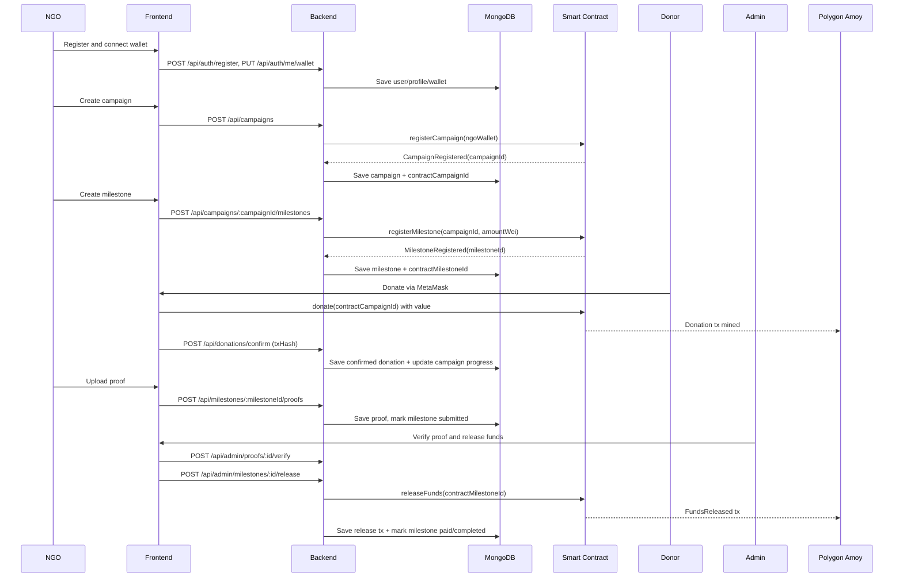

---

## 4) System Architecture

### High-level architecture

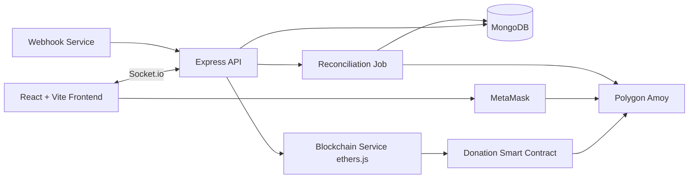

### Layer-by-layer explanation

Frontend:
- Role-based dashboards for admin, NGO, donor.
- **Real-time Updates**: Socket.io integration for instant notification toast and status refreshes.
- Wallet connect and chain enforcement to Polygon Amoy.
- Campaign creation, donation action, proof and release operations via API.

Backend:
- Auth, role middleware, validation, business services.
- **Socket.io Server**: Manages real-time event broadcasting to connected clients.
- **Webhook Integration**: Receives external transaction status updates for robust reconciliation.
- Smart-contract registration and release orchestration.
- Consistency checks between DB mappings and on-chain state.
- Audit logging and transaction persistence using Winston.

MongoDB:
- Stores users, campaigns, milestones, donations, proofs, transactions, wallet summaries.
- Keeps references to on-chain IDs (`contractCampaignId`, `contractMilestoneId`) and tx hashes.

Smart Contract:
- Escrow ledger by campaign.
- Milestone amount and release tracking.
- Owner-only registration/release controls.

Polygon Amoy:
- Testnet execution and explorer visibility.
- Required chain ID enforced as 80002 in backend/frontend runtime checks.

MetaMask + RPC:
- MetaMask signs donor donation txs and wallet interactions.
- Backend uses RPC endpoint for reads, status checks, and admin release tx submission via configured admin/deployer key.

Reconciliation Jobs:
- Optional background job polls pending txs and updates confirmed/failed status.
- Mirrors confirmed donations into donation records.

### Off-chain and on-chain sync strategy

Core strategy:
- MongoDB is the workflow system of record.
- Smart contract is the value transfer and escrow authority.
- Mapping fields bridge both worlds.

Sync points:
1. Campaign create -> register on-chain -> save `contractCampaignId`.
2. Milestone create -> register on-chain -> save `contractMilestoneId`.
3. Donation confirm -> validate tx decodes to `donate(campaignId)` and amount.
4. Release -> verify milestone-to-campaign mapping + NGO wallet + amount before `releaseFunds`.
5. Reconciliation job -> update pending tx states and mirror confirmations.

Operational script:
- `npm run sync:onchain` audits and repairs campaign/milestone mappings by registering missing IDs and validating mapping consistency.

---

## 5) Data Flow & System Flow Levels

This section provides a formal system modeling approach using Data Flow Diagrams (DFD) at multiple levels of abstraction, progressing from high-level context to detailed internal flows. These diagrams ensure anyone can understand TrustTrack's architecture and execution without reading source code.

### 5.1) DFD Level 0 — Context Flow

Context diagram showing external entities and overall data movement:

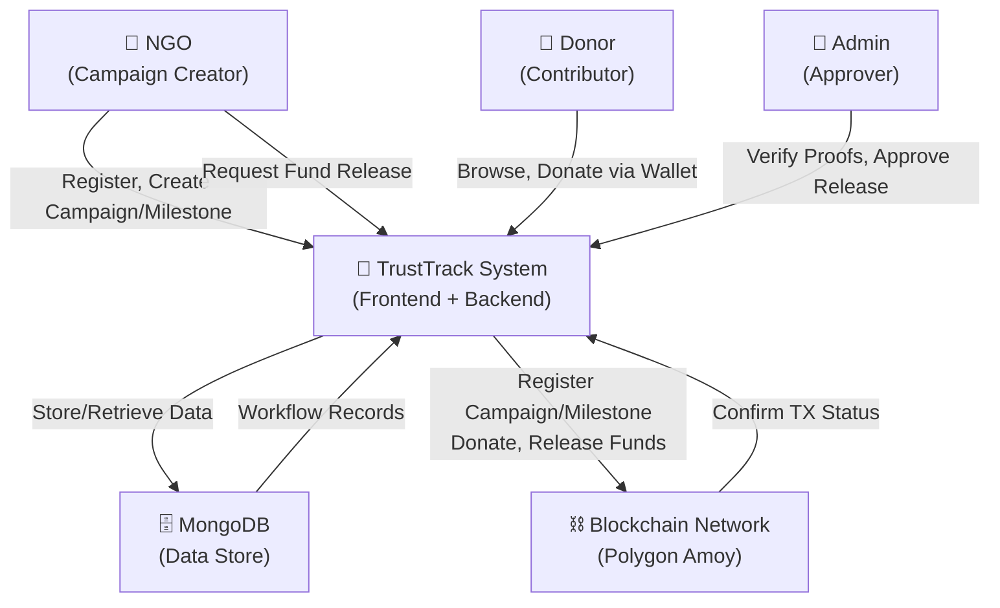

**Entities:**
- **NGO:** External actor registering campaigns and making fund requests.
- **Donor:** External actor connecting wallet and making donations.
- **Admin:** External actor verifying proofs and releasing funds.
- **TrustTrack System:** Application handling workflow, validation, and orchestration.
- **Blockchain (Polygon Amoy):** Immutable ledger for donations and fund releases.
- **MongoDB:** Persistent store for users, campaigns, milestones, proofs, wallets, and transactions.

---

### 5.2) DFD Level 1 — Module Decomposition

System decomposed into 7 core processes:

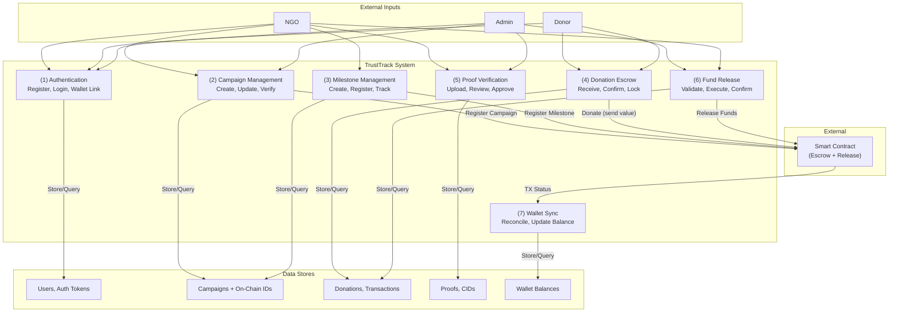

**Processes:**
1. **Authentication:** User registration, login, JWT token issue, wallet address linking.
2. **Campaign Management:** NGO creates campaign, sets funding goal, supplies wallet address; admin verifies campaign; on-chain registration stores contractCampaignId.
3. **Milestone Management:** NGO adds milestones with amounts; backend validates campaign, registers on-chain, stores contractMilestoneId.
4. **Donation Escrow:** Donor calls donate() via wallet; backend receives tx hash and status; funds locked in contract.
5. **Proof Verification:** NGO uploads proof (IPFS CID); admin reviews and verifies; proof status changes.
6. **Fund Release:** Admin approves release; backend validates wallet match and on-chain state; executes releaseFunds(milestoneId); funds transferred to NGO.
7. **Wallet Sync:** Optional reconciliation job polls pending txs from blockchain; updates DB status; mirrors to wallet and transaction records.

---

### 5.3) DFD Level 2 — Internal Deep Flows

Detailed data flows for 8 critical use cases:

#### **Use Case 1: Campaign Creation Flow**

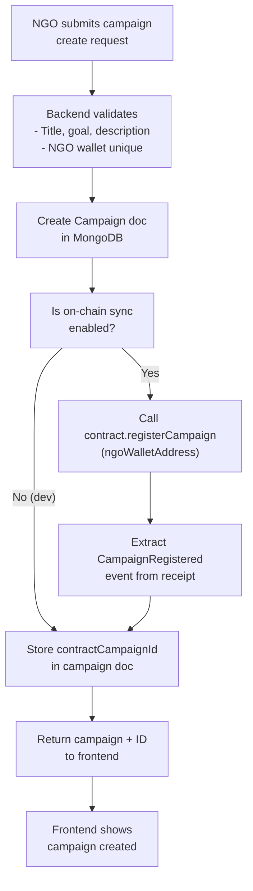

**Data Elements:**
- Input: NGO wallet address, title, description, fundingGoalINR
- Process: Validation, DB create, contract call, event extraction
- Output: contractCampaignId, campaign document
- Stores: campaigns collection (campaign), smart contract state

#### **Use Case 2: Milestone Creation Flow**

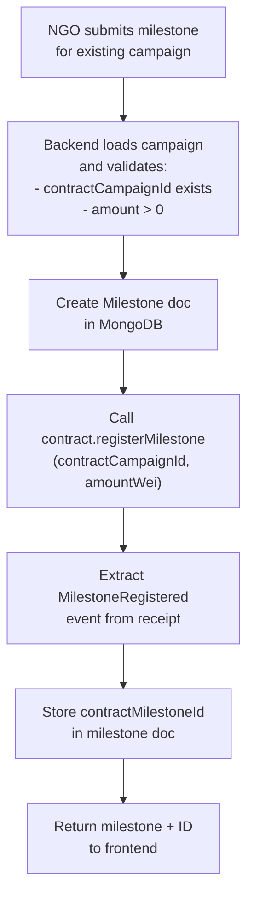

**Data Elements:**
- Input: Campaign ID, milestone title, amount (ETH)
- Validation: Campaign on-chain existence, amount positivity
- Output: contractMilestoneId, milestone document
- Stores: milestones collection, smart contract state

#### **Use Case 3: Donor Donation Flow**

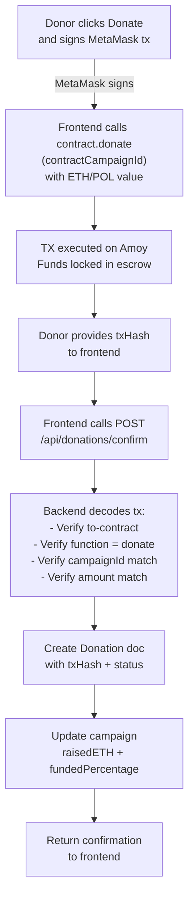

**Data Elements:**
- Input: contractCampaignId, amount (ETH), donor address
- On-chain: TX hash, donation amount credited to campaignFunds[id]
- Validation: TX receipt status, function decode, amount/campaign match
- Output: Confirmed donation record
- Stores: donations collection, campaigns collection (raisedETH updated)

#### **Use Case 4: Blockchain Escrow Update (On-Chain State)**

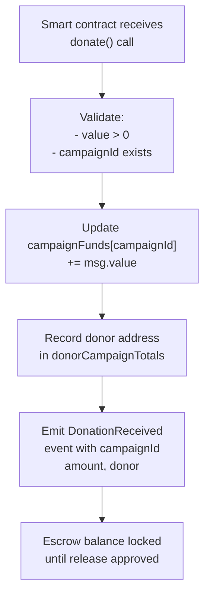

**Data Elements:**
- State: campaignFunds mapping (campaign ID → escrow balance)
- State: donorCampaignTotals mapping (campaign ID → donor → total amount)
- Events: DonationReceived(campaignId, donor, amount)
- Guard: Prevents double-release via milestoneReleased[id] flag

#### **Use Case 5: Proof Upload Flow**

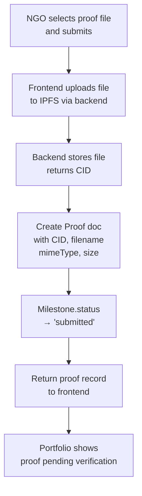

**Data Elements:**
- Input: File (binary), milestone ID
- Process: IPFS upload, file metadata extraction
- Output: CID (content hash), proof document
- Stores: proofs collection, milestones collection (status updated)

#### **Use Case 6: Admin Release Flow**

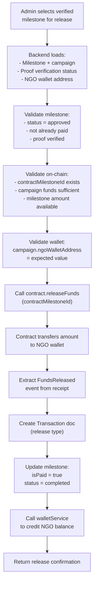

**Data Elements:**
- Input: Milestone ID, admin ID
- Validation: Milestone state, on-chain IDs, wallet match, fund sufficiency
- On-chain: milestoneReleased[id] = true, funds transferred to ngoWallet
- Output: Transaction record, release confirmation
- Stores: milestones collection (isPaid, status), transactions collection, wallets collection (balance updated)

#### **Use Case 7: NGO Payout Update Flow**

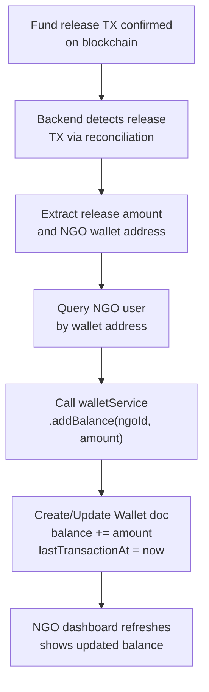

**Data Elements:**
- Input: Release TX hash, amount, NGO wallet
- Process: TX parsing, wallet lookup, balance credit
- Output: Updated wallet balance
- Stores: wallets collection

#### **Use Case 8: Transaction History Sync (Reconciliation Job)**

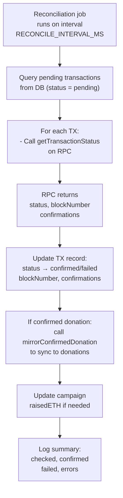

**Data Elements:**
- Query: Transaction records with status = 'pending'
- RPC call: getTransactionReceipt(txHash)
- Update: TX status, blockNumber, confirmations
- Side effect: Campaign progress update if donation confirmed
- Stores: transactions collection, donations collection

---

### 5.4) Sequence Flow — Generic Request Lifecycle

A generic diagram showing the flow of any user request through TrustTrack:

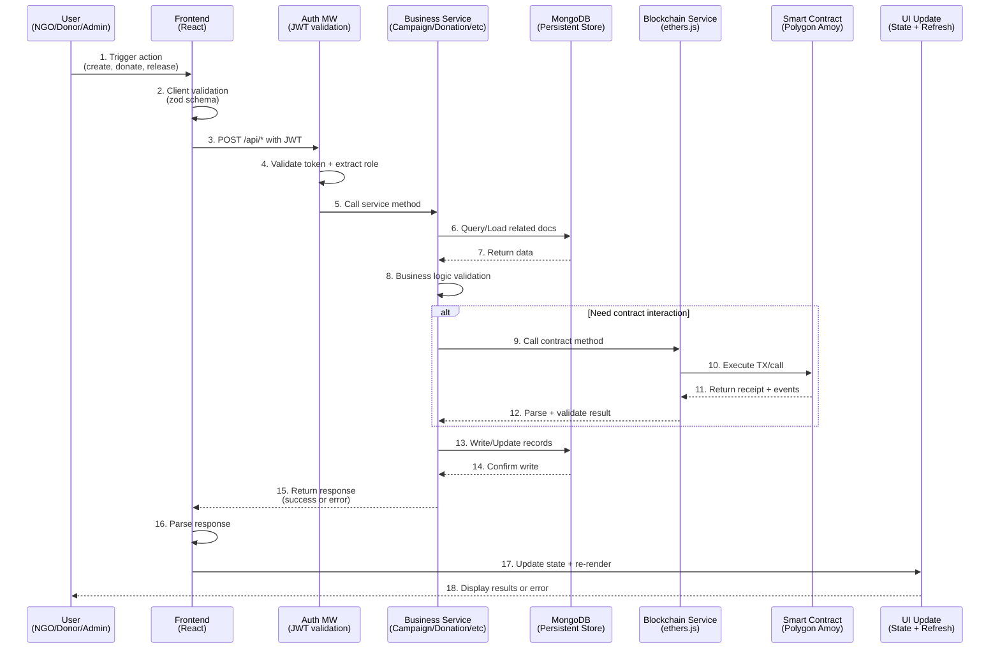

**Flow Steps:**
1. **User Input:** NGO creates campaign, donor donates, admin releases.
2. **Client Validation:** Zod schema checks basic payload integrity.
3. **API Auth:** POST to backend with Authorization header (JWT).
4. **Middleware Auth:** JWT validation extracts userId and role.
5. **Service Call:** Role-gated service method invoked.
6. **Data Load:** Related documents fetched from MongoDB.
7. **Business Logic:** Campaign limits, milestone state checks, wallet validation.
8. **Optional Contract:** If needed, blockchain service invoked (register, donate, release).
9. **Contract Execution:** Smart contract processes TX/call on Amoy.
10. **Event Extraction:** Receipt mined, events parsed for IDs.
11. **Blockchain Result:** Service receives validated contract response.
12. **DB Write:** New/updated records persisted.
13. **Response:** Success or error sent to frontend.
14. **UI Update:** Frontend updates state and re-renders.

---

### 5.5) Mermaid Workflow Diagrams

Four complementary diagrams showing role interaction, campaign, donation, and release lifecycles:

#### **Diagram 1: Role Interaction Flow**

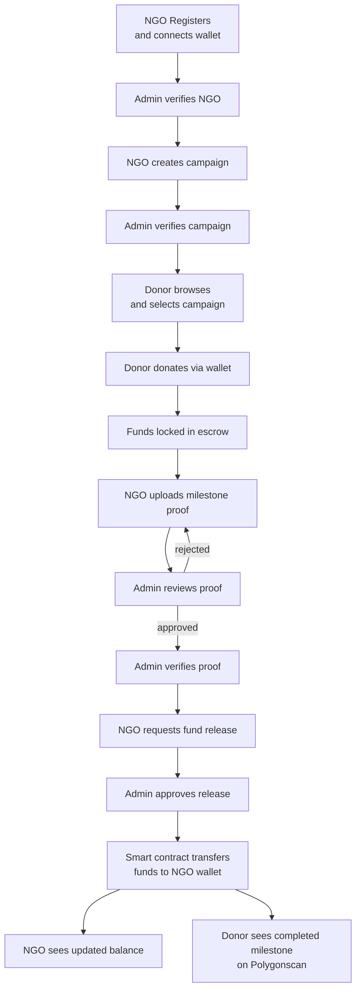

#### **Diagram 2: Campaign Lifecycle**

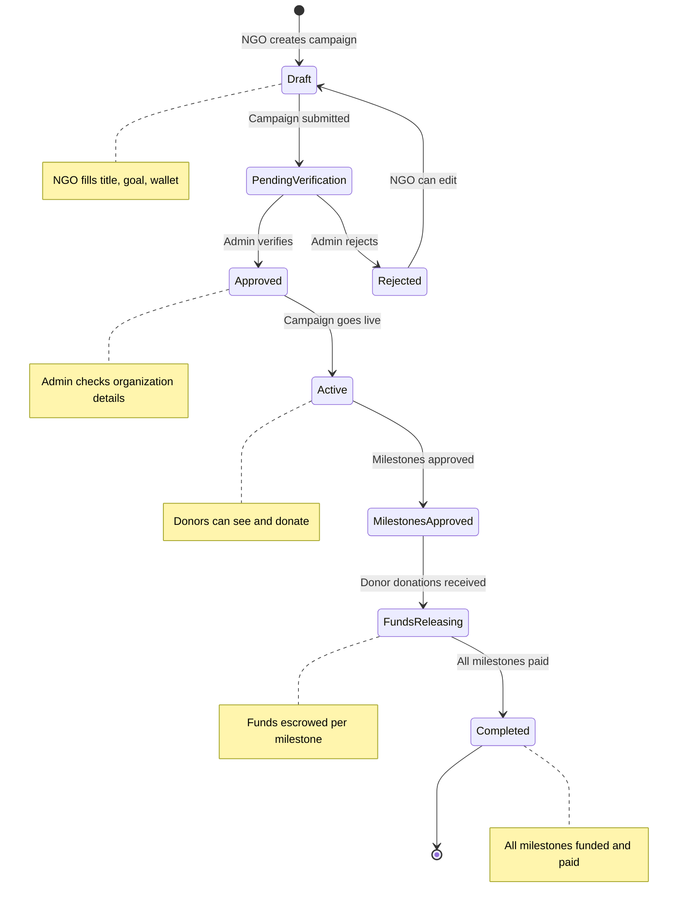

#### **Diagram 3: Donation Lifecycle**

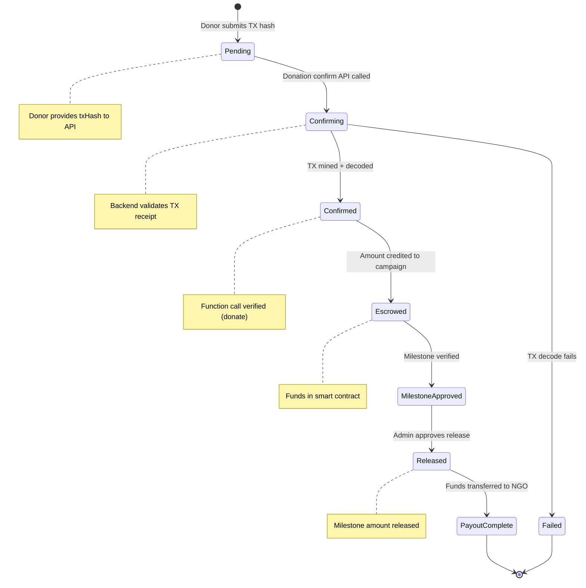

#### **Diagram 4: Release/Payout Lifecycle**

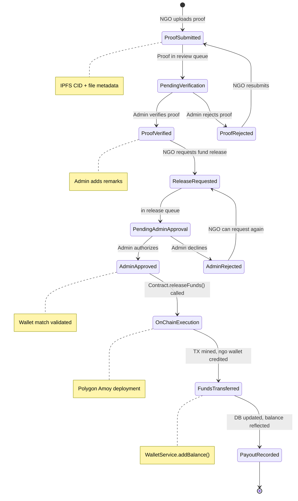

---

This Data Flow & System Flow Levels section ensures comprehensive understanding of TrustTrack's operation at all abstraction levels, from high-level context diagrams through detailed internal flows to concrete state machine transitions. A reader progressing through Levels 0 → 1 → 2 → Sequence → Workflows gains complete system knowledge without consulting source code.

---

## 6) Tech Stack

### Frontend

- **React 19**: Component-driven UI and role-specific dashboard development.
- **Vite**: Fast local development and optimized builds.
- **Zustand**: Lightweight auth/session and global state persistence.
- **TanStack React Query**: Efficient server-state management, caching, and background synchronization.
- **GSAP**: Premium animations for a refined and interactive user experience.
- **Socket.io Client**: Real-time event consumption for instant UI updates (notifications, status changes).
- **Tailwind CSS**: Utility-first styling for fast UI iteration and consistency.
- **Ethers.js / Wagmi / Viem**: Robust blockchain interaction layer for wallet connectivity and contract calls.

### Backend

- **Node.js + Express**: Structured REST API and middleware ecosystem.
- **Socket.io Server**: Real-time bidirectional communication for live notifications.
- **MongoDB + Mongoose**: Scalable document storage with flexible schema modeling.
- **Winston + Morgan**: Professional-grade logging and request tracking.
- **Zod**: Strict schema-based validation for request payloads and environments.
- **ImageKit / IPFS Client**: Hybrid storage strategy for high-performance asset delivery and decentralized proofs.
- **Multer**: Middleware for handling multipart/form-data (file uploads).

### Blockchain

- **Solidity 0.8.24**: Secure smart contract development with modern math safety.
- **Hardhat**: Comprehensive development suite for local node, testing, and deployment scripts.
- **Ethers.js (Backend)**: Orchestrate on-chain actions like campaign registration and fund release.
- **Polygon Amoy**: Public testnet for realistic, low-cost integration and validation.
- **MetaMask**: Industry-standard wallet provider for donor signing.

---

## 7) Smart Contract Design

Contract: `backend/contracts/Donation.sol`

### Data structures

- `campaignFunds[campaignId]`:
  Total escrowed funds for each campaign.
- `donorCampaignTotals[campaignId][donor]`:
  Donor-level contribution tracking.
- `campaignNgoWallet[campaignId]`:
  Registered payout wallet.
- `milestoneToCampaign[milestoneId]`:
  Mapping milestone to campaign.
- `milestoneReleaseAmount[milestoneId]`:
  Fixed amount releasable for milestone.
- `milestoneReleased[milestoneId]`:
  Prevents double release.

### Core functions

1. `registerCampaign(address payable ngo)`
- Only owner/admin can call.
- Auto-generates campaign ID.
- Links campaign to NGO wallet.

2. `registerMilestone(uint256 campaignId, uint256 amountWei)`
- Only owner/admin can call.
- Auto-generates milestone ID.
- Stores milestone amount and campaign mapping.

3. `donate(uint256 campaignId) payable`
- Anyone can donate with value > 0.
- Increases campaign escrow balance.
- Emits `DonationReceived` event.

4. `releaseFunds(uint256 milestoneId)`
- Only owner/admin can call.
- Requires valid milestone mapping and sufficient escrow.
- Prevents duplicate release.
- Transfers funds directly to NGO wallet.
- Emits `FundsReleased` event.

### Security checks used in contract

- `onlyOwner` on campaign/milestone registration and release.
- `nonReentrant` on donation and release.
- Zero address checks.
- Positive amount checks.
- Sufficient escrow balance checks.
- One-time milestone release enforcement.

### On-chain mappings and tx hashes

On-chain IDs:
- `contractCampaignId` and `contractMilestoneId` are generated by contract events and stored in MongoDB.

Tx hash usage:
- Donation tx hash is validated and persisted on confirmation.
- Release tx hash is persisted after successful on-chain release.
- Both are shown in UI and linkable on Polygonscan.

### NGO wallet validation rules

- Campaign stores `ngoWalletAddress` in DB.
- Release flow rejects if expected wallet does not match campaign-linked wallet.
- Backend verifies routing before release to avoid wrong-recipient payout.

---

## 8) Database Design

TrustTrack primarily uses the following collections:

### `users`

Purpose:
- Stores admin/ngo/donor identities, role, auth metadata, and profile.

Key fields:
- `email`, `passwordHash`, `role`, `walletAddress`
- `isVerified`, `verificationStatus`
- `profile.name`, `profile.organizationName`
- `refreshTokens`

Note:
- NGO identity is represented in `users` with `role = ngo`.

### `campaigns`

Purpose:
- NGO-created donation campaigns and funding progress.

Key fields:
- `title`, `description`, `fundingGoalINR`, `fundingGoalETH`, `raisedETH`
- `ngo` (User ref), `ngoWalletAddress`
- `status`
- `contractCampaignId`

### `milestones`

Purpose:
- Campaign progress checkpoints with releasable amounts.

Key fields:
- `campaign` (Campaign ref), `title`, `amount`, `status`
- `contractCampaignId`, `contractMilestoneId`
- `isPaid`, `fundsReleased`, `txHash`
- `fundRequest` subdocument with request/release metadata

### `donations`

Purpose:
- Donation records tied to campaign + donor + tx status.

Key fields:
- `campaign`, `donor`, `amountETH`, `currency`
- `txHash`, `status`, `metadata`, `confirmedAt`

### `proofs`

Purpose:
- Evidence uploaded by NGOs for milestone completion.

Key fields:
- `milestone`, `uploader`
- `cid`, `filename`, `mimeType`, `size`
- `status`, `remarks`

### `transactions` (release and donation ledger mirror)

Purpose:
- Unified operational transaction tracking for donation/release states.

Key fields:
- `txHash`, `type` (`donation`/`release`/`other`), `status`, `network`
- `campaign`, `milestone`, `donor`, `ngoWallet`
- `blockNumber`, `confirmations`, `receipt`

### `wallets`

Purpose:
- App-level wallet summary for each user.

Key fields:
- `userId`, `balance`, `currency`, `transactionCount`, `lastTransactionAt`

### Entity relationship snapshot

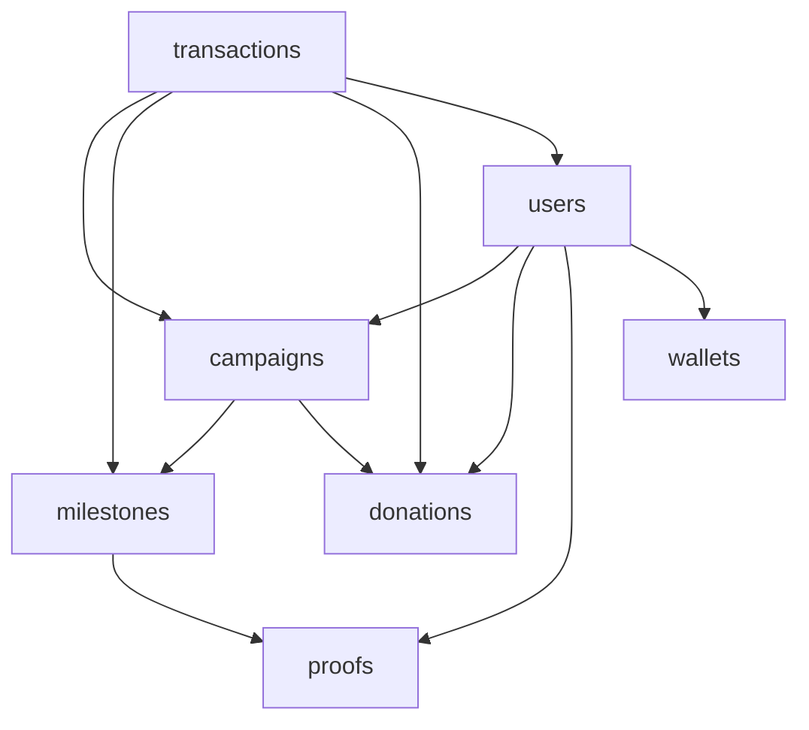

---

## 9) API Flow

Base path: `/api`

### Auth

- `POST /api/auth/register`
- `POST /api/auth/login`
- `POST /api/auth/refresh`
- `GET /api/auth/me`
- `PUT /api/auth/me/wallet`

Highlights:
- Public registration rejects admin self-registration.
- Wallet update enforces unique address per user.

### Campaign

- `GET /api/campaigns`
- `GET /api/campaigns/:id`
- `POST /api/campaigns` (ngo)
- `PATCH /api/campaigns/:id` (owner/admin)
- `DELETE /api/campaigns/:id` (owner/admin)

### Milestone

- `POST /api/campaigns/:campaignId/milestones` (owner/admin)
- `GET /api/campaigns/:campaignId/milestones`
- `GET /api/milestones/:id`
- `PATCH /api/milestones/:id`
- `DELETE /api/milestones/:id` (admin)

### Donation

- `GET /api/donations`
- `GET /api/donations/:id`
- `POST /api/donations`
- `POST /api/donations/confirm`

### Proof

- `POST /api/milestones/:milestoneId/proofs`
- `GET /api/proofs/me`

### Admin proof and release

- `GET /api/admin/proofs`
- `POST /api/admin/proofs/:id/verify`
- `POST /api/admin/proofs/:id/reject`
- `POST /api/admin/milestones/:id/release`
- `POST /api/admin/milestones/:id/release-funds`
- `GET /api/admin/contract-balance`
- `GET /api/admin/campaign-funds`

### NGO wallet and fund request

- `GET /api/ngo/profile`
- `PUT /api/ngo/profile`
- `GET /api/ngo/wallet`
- `GET /api/ngo/wallet/balance`
- `POST /api/ngo/milestones/:id/request-funds`

### Donor wallet

- `GET /api/donor/wallet`
- `GET /api/donor/wallet/balance`

### API release flow (technical)

```mermaid
flowchart LR
    A[Admin calls release endpoint] --> B[Load milestone and campaign]
    B --> C[Validate approved state and unpaid]
    C --> D[Validate campaign and milestone on-chain IDs]
    D --> E[Validate NGO wallet match]
    E --> F[Assert on-chain routing and amount]
    F --> G[Call releaseFunds(milestoneId)]
    G --> H[Store tx and mark milestone paid]
```

---

## 10) Frontend Folder Architecture

```text
frontend/
  src/
    components/
      common/        # Shared layout UI (sidebar, top nav)
      ui/            # Reusable cards, tables, wallet donation widgets
    hooks/           # React Query hooks + wallet hooks
    layouts/         # Admin/NGO/Donor shells and nested routes
    pages/
      admin/         # Proof verification, NGO verification, monitoring
      ngo/           # Campaign CRUD, fund request, proof submission, wallet
      donor/         # Explore, donate, donation history, wallet
      auth/          # Login
    routes/          # App routes and protected route logic
    services/        # API clients grouped by feature
    store/           # Zustand auth/session store
    lib/
      axios.js       # API base and token interceptor
      contracts/     # Donation ABI used by wallet donation hook
    schemas/         # Client-side validation schemas
    utils/           # Helpers
```

How folders connect:
- `pages` consume `hooks` and `services`.
- `services` call backend API via `lib/axios`.
- Wallet and donation UI in `components/ui` use hooks from `hooks/useWallet` and `hooks/useDonateWithWallet`.
- `layouts` separate role experiences.

---

## 11) Environment Variables

Use `.env` files in both backend and frontend projects.

Important: Never commit real secrets. Rotate any leaked keys immediately.

## 12) Local Setup

### Prerequisites

- Node.js 18+ (recommended LTS)
- npm 9+
- MongoDB Atlas URI or local MongoDB
- MetaMask browser extension
- Polygon Amoy RPC endpoint
- Testnet POL in wallet

### Step-by-step local setup (Hardhat Node)

1. Clone and install dependencies
```bash
# from project root
cd backend && npm install
cd ../frontend && npm install
```

2. Start the Local Blockchain Node
```bash
cd backend
npx hardhat node
```

3. Deploy the Smart Contract
Open a NEW terminal in the `backend` folder:
```bash
npx hardhat run scripts/deploy.js --network localhost
```
*Note: This will output the `DONATION_CONTRACT_ADDRESS`. Copy it.*

4. Configure environment variables
- **Backend**: Create `backend/.env` with the contract address from step 3.
- **Frontend**: Create `frontend/.env` with the same contract address.

5. Start the Backend
Open a NEW terminal in the `backend` folder:
```bash
npm run dev
```

6. Start the Frontend
Open a NEW terminal in the `frontend` folder:
```bash
npm run dev
```

7. Setup MetaMask for Localhost
- Network name: Hardhat Local
- Chain ID: 31337
- RPC URL: `http://127.0.0.1:8545`
- Symbol: ETH

### Useful local commands

Backend:

```bash
npm run test
npm run hh:compile
npm run hh:node
npm run hh:deploy:local
npm run sync:onchain
npm run migrate:contract-ids
```

Frontend:

```bash
npm run dev
npm run build
npm run preview
npm run lint
```

---

## 13) Demonstration Guide (Step-by-Step)

Follow these steps to demonstrate the end-to-end functionality to a teacher:

### Phase 1: Setup
1. Start Hardhat Node, Deploy Contract, and Start Apps (Backend & Frontend).
2. Login to MetaMask using any Hardhat account (e.g., Account #0).
3. Reset MetaMask (Settings -> Advanced -> Clear activity tab data) to avoid nonce issues.

### Phase 2: NGO Flow (The Request)
1. **Register as NGO**: Sign up with a new account (role: NGO).
2. **Setup Profile**: Connect your wallet in the NGO dashboard.
3. **Create Campaign**: Click "Create Campaign", fill in the details (e.g., Goal: 10,000 INR).
4. **Add Milestones**: Add at least 2 milestones for the campaign.

### Phase 3: Donor Flow (The Funding)
1. **Switch Account**: Log out and Register/Login as a **Donor**.
2. **Find Campaign**: Browse the active campaigns and find the one created by the NGO.
3. **Donate**: Donate an amount (e.g., 5,000 INR) using your wallet. Confirm the transaction in MetaMask.
4. **Verify Tracking**: Show the "Funds Raised" progress bar updating in real-time.

### Phase 4: Proof & Release Flow (The Transparency)
1. **NGO Uploads Proof**: Log back in as the **NGO**. Go to the milestone and click "Upload Proof". Select a file (e.g., an invoice image) and submit.
2. **Admin Verification**: Log in as the **Admin** (use configured admin credentials).
3. **Review Proof**: Go to "Proof Verification", view the uploaded document, and click "Verify".
4. **Release Funds**: Once verified, click "Release Funds".
5. **Success**: Show that the funds have been successfully transferred from the contract escrow to the NGO's wallet address.

---

## 14) Production/Testnet Deployment

This section assumes Polygon Amoy testnet deployment.

### 1. Compile and deploy contract

```bash
cd backend
npm run hh:compile
npm run hh:deploy:amoy
```

Deployment script outputs:
- `backend/deployments/polygonAmoy.donation.json`
- `frontend/src/lib/contracts/donationAbi.json`

### 2. Update backend env

Set:
- `DONATION_CONTRACT_ADDRESS` to deployed address
- `ETHEREUM_RPC_URL` to stable Amoy RPC
- `DONATION_ADMIN_ADDRESS` to intended owner/admin wallet
- `DEPLOYER_PRIVATE_KEY` for admin release signing

### 3. Update frontend env

Set:
- `VITE_DONATION_CONTRACT` to deployed address
- `VITE_API_BASE_URL` to deployed backend base path

### 4. Sync and Migration Tools

If you are migrating existing data or need to audit on-chain mappings:

```bash
cd backend
# Synchronize missing on-chain IDs with existing DB records
npm run sync:onchain

# [NEW] Migrate local/temporary IDs to contract-generated sequence IDs
npm run migrate:contract-ids

# [NEW] Reset database collections to sync with a fresh Hardhat node
npm run db:reset
```

### 5. Role-Specific Testing
For detailed instructions on testing the NGO wallet lifecycle and troubleshooting MetaMask, see:
[NGO_WALLET_TESTING_GUIDE.md](frontend/NGO_WALLET_TESTING_GUIDE.md)

### 6. Verify explorer visibility

- Contract page: `https://amoy.polygonscan.com/address/<contractAddress>`
- Donation tx: `https://amoy.polygonscan.com/tx/<donationTxHash>`
- Release tx: `https://amoy.polygonscan.com/tx/<releaseTxHash>`

### 6. Run backend and frontend in deployment mode

Backend:
```bash
npm run start
```

Frontend:
```bash
npm run build
npm run preview
```

---

## 15) Known Issues and Debug Guide

### 1. Chain mismatch

Symptoms:
- Wallet connect errors or donation disabled.
- Runtime errors about invalid chain ID.

Checks:
- MetaMask network must be 80002.
- `VITE_CHAIN_ID` and backend `CHAIN_ID` must both be 80002.

Fix:
- Switch MetaMask network to Polygon Amoy.
- Correct `.env` values and restart apps.

### 2. Missing POL balance

Symptoms:
- Donation tx/release tx fails with insufficient funds.

Checks:
- Donor wallet has test POL for donation + gas.
- Admin/deployer wallet has POL for release tx gas.

Fix:
- Request faucet POL and retry.

### 3. Port Conflicts (EADDRINUSE)

Symptoms:
- Backend fails to start with "Port 4000 is already in use".
- "Another backend instance is active (PID XXXX)" warning in logs.

Checks:
- Check for existing node processes on port 4000: `netstat -ano | findstr :4000` (Windows) or `lsof -i :4000` (Unix).
- Look at the `.runtime/backend-dev.pid` file to see the last registered PID.

Fix:
- The backend automatically tries fallback ports (4001, 4002) if 4000 is busy.
- To force kill the existing instance: `taskkill /PID <PID> /F` (Windows) or `kill -9 <PID>` (Unix).
- Delete the `.runtime/` directory if state is corrupted.

### 4. Wrong contract address

Symptoms:
- Contract read/write fails.
- Donation UI says invalid contract address.

Checks:
- Frontend `VITE_DONATION_CONTRACT` matches same address.

### 5. Blockchain/Database Desync (Duplicate Key Error)

Symptoms:
- `E11000 duplicate key error` shown in logs or UI.
- Failures when creating campaigns or milestones with IDs that "already exist".

Checks:
- Did you restart your Hardhat node (`npx hardhat node`) but keep MongoDB running?
- Hardhat resets its internal counters, while MongoDB persists previous IDs.

Fix:
- Run `npm run db:reset` in the backend directory to zero-out stale database records.
- This ensures your database state perfectly matches your fresh blockchain state.
- Address has code on Amoy explorer.

Fix:
- Redeploy and update envs consistently.

### 4. Stale DB mappings (`contractCampaignId` or `contractMilestoneId`)

Symptoms:
- Release routing mismatch.
- Milestone not registered on-chain errors.

Checks:
- Campaign and milestone docs contain on-chain IDs.

Fix:
- Run `npm run sync:onchain`.
- Recheck mapping audit output.

### 5. Env fallback risks

Symptoms:
- App starts on unexpected port or wrong API base.
- Localhost RPC accidentally used in restricted runtime.

Checks:
- Backend enforces Polygon Amoy in non-test runtime.
- Frontend requires explicit `VITE_API_BASE_URL` and chain values.

Fix:
- Set explicit env values and restart.

### 6. Transaction failures

Symptoms:
- Donation confirm fails.
- Release endpoint returns route/amount/wallet mismatch.

Checks:
- Donation tx must call `donate(contractCampaignId)` on configured contract.
- Release requires milestone approved and not already paid.
- NGO wallet expected by admin UI must equal campaign-linked wallet.

Fix:
- Verify tx decode assumptions (campaign ID, amount, to-contract).
- Verify milestone state and wallet alignment.
- Reattempt with correct on-chain IDs.

### 7. Reconciliation not updating pending txs

Symptoms:
- Pending transactions remain stale.

Checks:
- `ENABLE_RECONCILIATION=true`
- RPC endpoint reachable.
- Interval and batch values are valid.

Fix:
- Enable reconciliation and inspect backend logs.

### 8. Insufficient campaign escrow funds (1-Wei error)

Symptoms:
- Fund release fails with "Insufficient campaign escrow funds".
- Milestone amount is 1 Wei higher than the campaign balance.

Checks:
- This was a known floating-point precision issue in JavaScript.

Fix:
- System now uses `.toFixed(15)` rounding to eliminate binary noise.
- For old campaigns, donate a tiny amount (e.g., 0.00001 ETH) to "rescue" the campaign.

### 9. MetaMask Nonce Mismatch (Hardhat)

Symptoms:
- Transactions stay "Pending" forever or fail immediately on Localhost.

Fix:
- Go to MetaMask Settings -> Advanced -> Clear activity tab data. This resets the nonce for the local account.

---

## 16) Future Scope

TrustTrack can evolve into a stronger public-goods platform with:

1. DAO governance
- Community voting for campaign approvals, release thresholds, and policy updates.

2. Multisig admin control
- Replace single-owner release authority with multisig wallet governance.

3. Fraud analytics
- Rule-based and graph-based detection for suspicious donation/release patterns.

4. AI anomaly detection
- Detect unusual fundraising velocity, wallet clustering, and proof authenticity anomalies.

5. Real NGO verification integrations
- Connect with legal/registry verification providers for stronger KYC/compliance.

---

## Project Structure Snapshot

```text
TrustTrack/
  backend/
    contracts/
    deployments/
    scripts/
    src/
      controllers/
      services/
      routes/
      models/
      middleware/
      jobs/
      validation/
      __tests__/
  frontend/
    src/
      pages/
      components/
      hooks/
      services/
      layouts/
      routes/
      lib/
      store/
```

---

## Final Notes for New Developers

If you are onboarding for the first time, this is the fastest mental model:

1. MongoDB tracks who did what and when.
2. Smart contract controls where money is locked and released.
3. `contractCampaignId` and `contractMilestoneId` are the bridge between both worlds.
4. Donors donate on-chain.
5. NGOs prove progress off-chain.
6. Admins verify off-chain and release on-chain.
7. Polygonscan is the public source of truth for value movement.

This gives TrustTrack both usability (web app workflows) and auditability (public, immutable fund trails).
